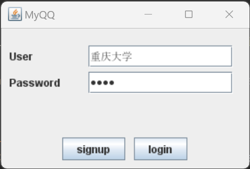
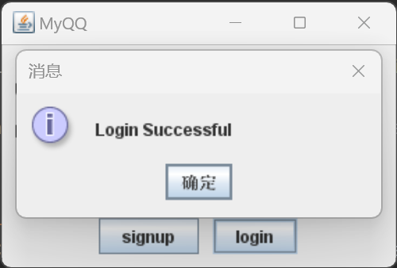
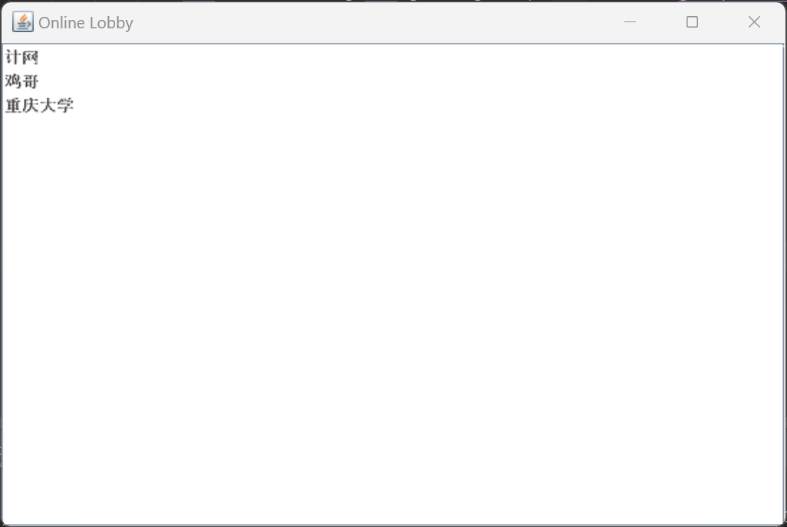
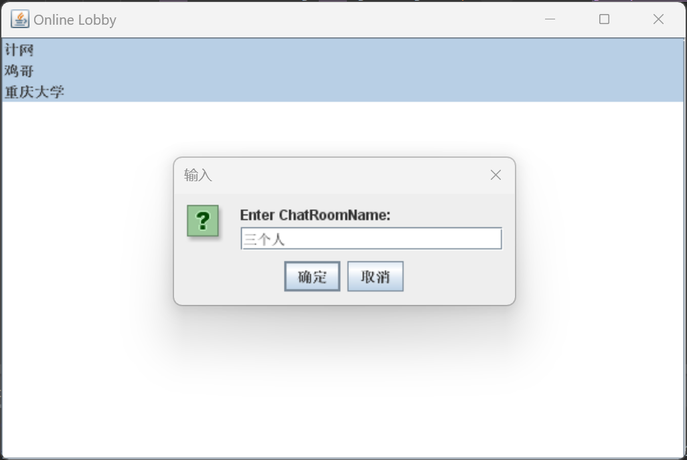
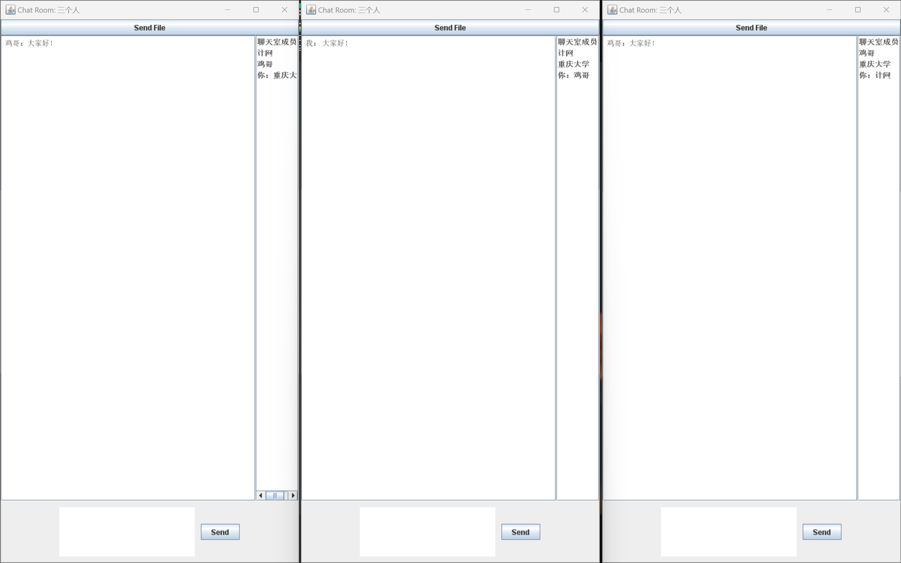
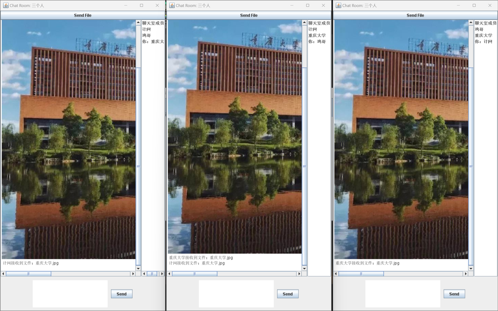

### 使用流程：
### 1.先按照“src/main/resources/application.yml”中的配置起一个mysql数据库，建一个user表，包含nickname和password两个字段
### 2.run "src/main/java/com/mq/myqq/Server.java"
### 3.run "src/main/java/com/mq/myqq/Client.java"
### ps:在线大厅要选择多个用户创建聊天室时，可以按住ctrl多选，然后鼠标右键创建。其他电脑上Client中的SERVER_IP要改成起mysql主机的IP，如果连接数据库有问题可能是端口没加入防火墙
### 软件截图：

